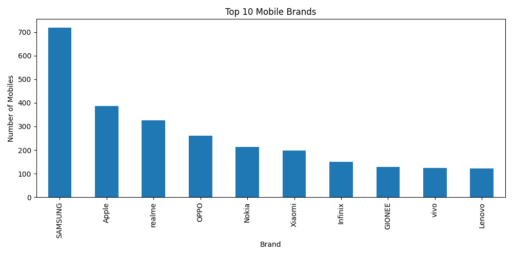
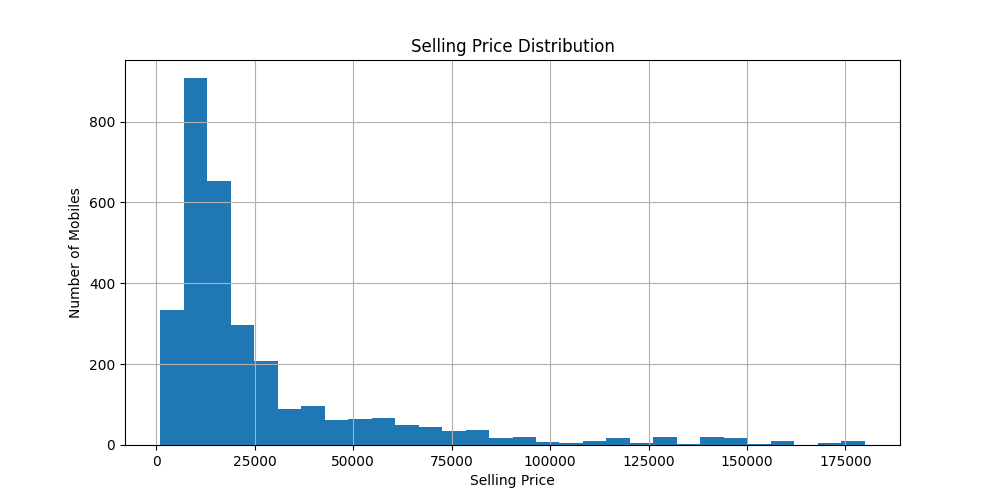
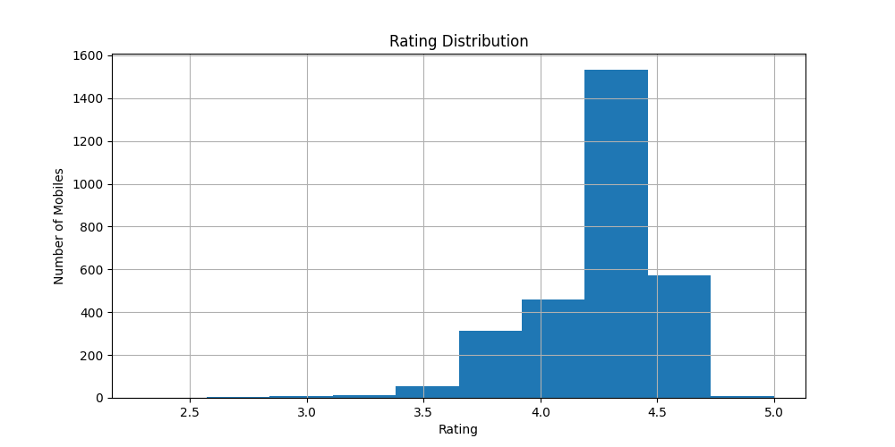
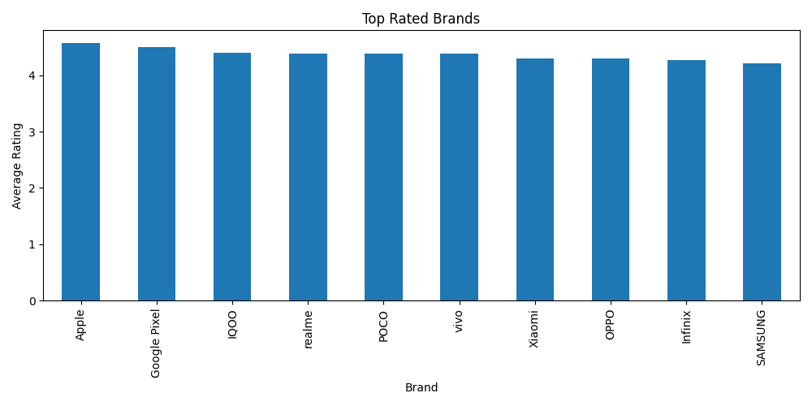
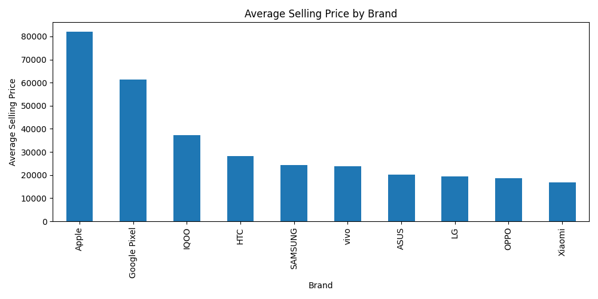

# Flipkart Mobile Data Analysis

## Project Overview

This project analyzes a dataset of 3,114 mobile phones from Flipkart using Python, Pandas, and Matplotlib.

The objective is to explore mobile brands, pricing trends, ratings, and market insights through Exploratory Data Analysis (EDA).

## Dataset Information

- Total Records: 3114
- Features:
  - Brand
  - Model
  - Color
  - Memory
  - Storage
  - Rating
  - Selling Price
  - Original Price

## Tools & Technologies

- Python
- Pandas
- Matplotlib

## Analysis Performed

### Brand Analysis
- Top 10 Mobile Brands

### Price Analysis
- Average Selling Price
- Highest Selling Price
- Lowest Selling Price
- Selling Price Distribution

### Rating Analysis
- Average Rating
- Rating Distribution
- Top Rated Brands

### Brand Price Analysis
- Average Selling Price by Brand

## Key Insights

- Samsung dominates the dataset with the highest number of mobile models.
- Most phones are priced below ₹25,000.
- Premium phones create a long-tail price distribution.
- Most ratings fall between 4.0 and 4.5.
- Apple and Google Pixel rank among the highest-rated brands.

## Visualizations

## Author

Balaji Nadar

Data Analytics & AI Enthusiast
